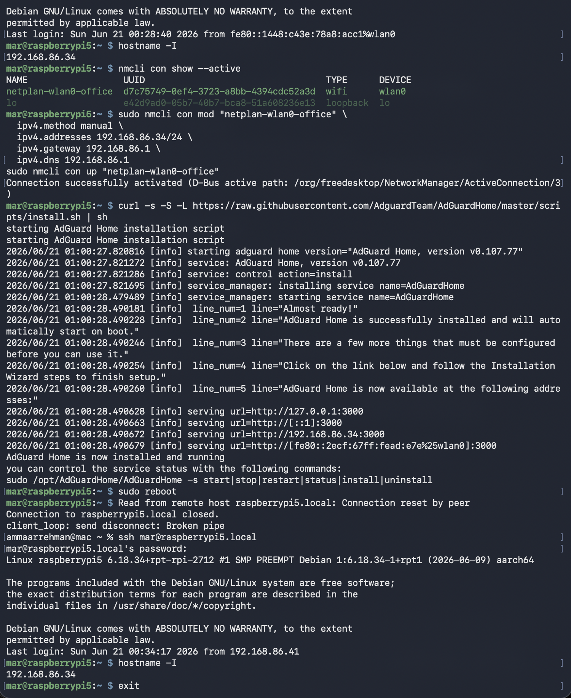
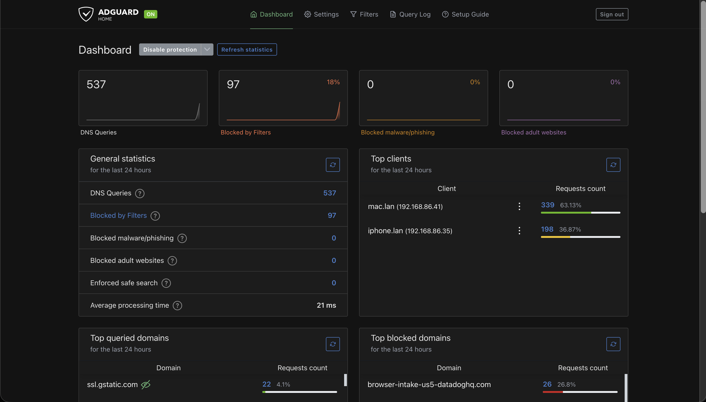
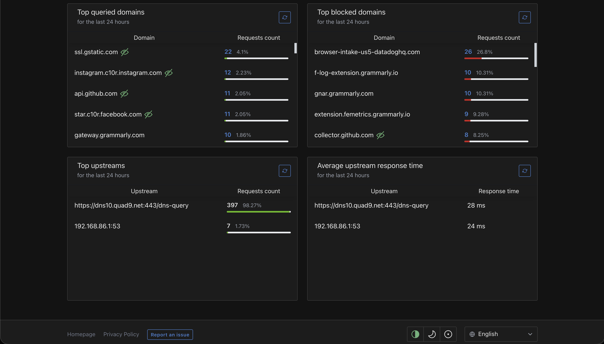

# Raspberry Pi 5 Homelab: Network DNS Filtering with AdGuard Home

A personal homelab project. This documents standing up a Raspberry Pi 5 as a headless Linux node and running AdGuard Home for network-wide DNS filtering.

## Goal

Run a low-power, always-on DNS resolver that filters ads and trackers for the devices pointed at it, and use it as the first hands-on service in a growing homelab.

## Hardware

- Raspberry Pi 5
- microSD boot drive (NVMe planned, mounted in a 1U bracket inside a DeskPi RackMate T1)
- Network: Google Wifi / Nest mesh, 192.168.86.0/24

## Base OS setup

- Raspberry Pi OS Lite, 64-bit, headless (no desktop)
- Flashed with Raspberry Pi Imager with SSH, Wi-Fi, hostname, and user preconfigured, so the Pi came up headless on first boot
- Hostname: `raspberrypi5`
- User: `mar`

First connection:

```bash
ssh mar@raspberrypi5.local
```

Update the system before anything else:

```bash
sudo apt update && sudo apt full-upgrade -y
sudo reboot
```

## Project 1: AdGuard Home

### 1. Give the Pi a static IP

The router on this network is not under my control (shared household network), so instead of a DHCP reservation the static IP is set on the Pi itself with NetworkManager.

Find the active connection name and current IP:

```bash
nmcli con show --active
hostname -I
```

Pin the IP. This network is 192.168.86.0/24, gateway 192.168.86.1, and the Pi keeps .34. The Pi's own DNS is set to the router so it can still resolve names while AdGuard is being installed:

```bash
sudo nmcli con mod "netplan-wlan0-office" \
  ipv4.method manual \
  ipv4.addresses 192.168.86.34/24 \
  ipv4.gateway 192.168.86.1 \
  ipv4.dns 192.168.86.1
sudo nmcli con up "netplan-wlan0-office"
```

Use the connection name shown by `nmcli con show --active` (here it is `netplan-wlan0-office`). SSH may drop for a second while the connection reapplies; reconnect with `ssh mar@raspberrypi5.local`.

The `netplan-` prefix means netplan manages the network config, so confirm the static IP survives a reboot with `hostname -I`. If it reverts to DHCP, set the static address in the netplan YAML under `/etc/netplan/` instead, then run `sudo netplan apply`.

### 2. Install AdGuard Home

```bash
curl -s -S -L https://raw.githubusercontent.com/AdguardTeam/AdGuardHome/master/scripts/install.sh | sh
```

The installer prints a setup URL like `http://192.168.86.34:3000`.

### 3. Run the setup wizard

Open the setup URL in a browser and set:

- Admin web interface port: `3000`
- DNS port: `53`

Then create the admin username and password.

### 4. Point devices at the Pi

Installing AdGuard does nothing until DNS traffic flows through it. With no router access there is no network-wide DNS change, so each device is pointed at the Pi by hand. This also keeps the rest of the household off the Pi, so a reboot never takes down anyone else's internet.

Set DNS to `192.168.86.34` on each device:

- macOS: System Settings, Network, Wi-Fi, Details, DNS, add the IP
- iPhone: Wi-Fi, tap the network, Configure DNS, Manual, add the IP
- Windows: network adapter settings, edit DNS, Manual, add the IP

### 5. Test

- Reconnect a device to Wi-Fi so it picks up the new DNS
- Open the AdGuard dashboard and watch the Query Log fill with live requests
- Confirm blocked domains show up as filtered

Quick check from any machine:

```bash
nslookup google.com 192.168.86.34
```

## Screenshots

Static IP set on the Pi and confirmed after a reboot:



AdGuard Home dashboard with live query stats:



Query log showing requests filtered in real time:



## Roadmap

1. Tailscale: secure remote access to the Pi from anywhere
2. Docker: container platform for everything that follows
3. Uptime Kuma: self-hosted monitoring dashboard, runs in Docker
4. Write-up comparing AdGuard Home and Pi-hole as DNS filtering approaches

## Notes

- A device's DNS server must point at the Pi for filtering to happen. The install step alone changes nothing.
- The Pi needs a fixed IP. With no router access, the static IP is set on the Pi itself rather than reserved at the router.
- Per-device DNS keeps a single point of failure off a shared household network. If the Pi reboots, only the devices pointed at it are affected.
- AdGuard Home and Pi-hole both use port 53, so only one runs on a given host at a time.

## Linux commands worth knowing for this build

```bash
pwd        # where am I
ls         # list files
cd         # change directory
ip a       # network interfaces and IPs
free -h    # memory usage
df -h      # disk usage
```
