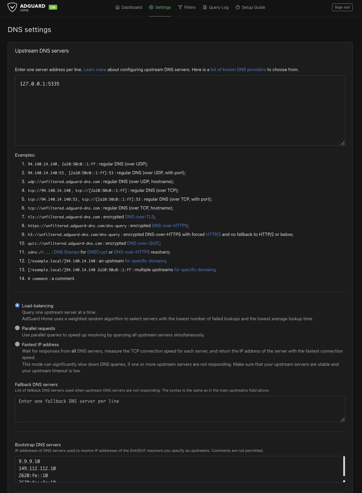
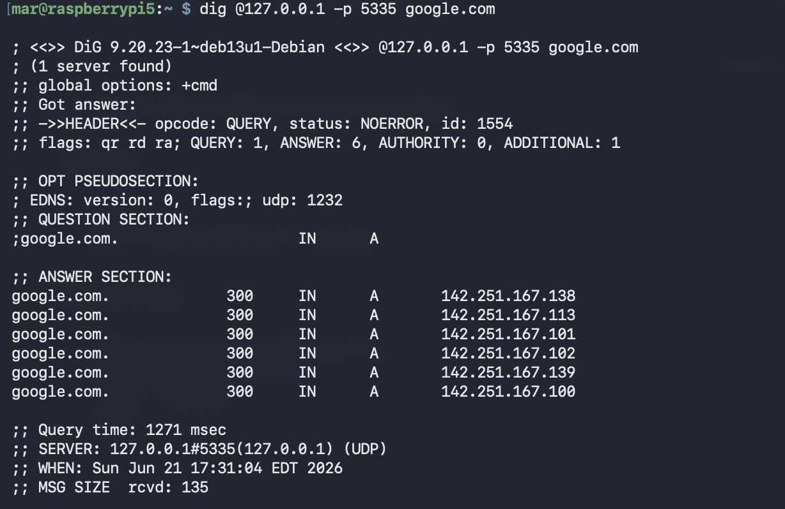
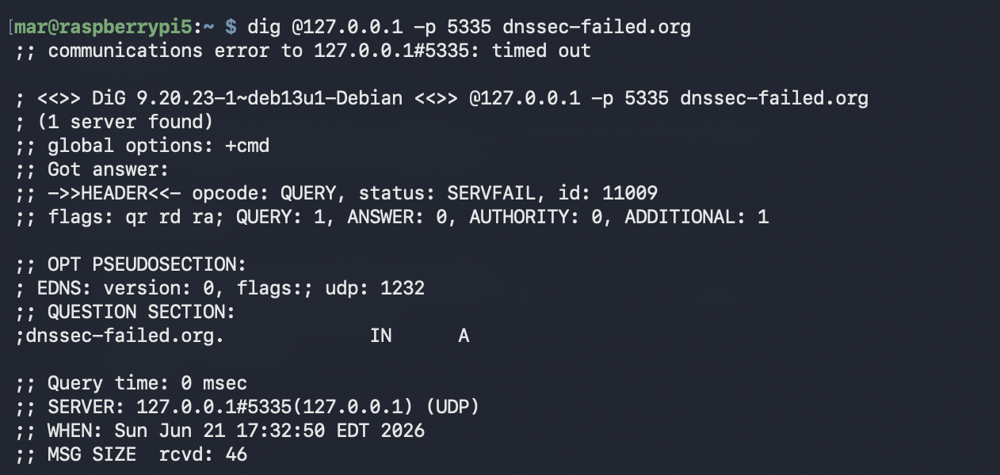

# Home Network DNS Filtering and Recursive Resolution

Self-hosted DNS filtering and recursive DNS resolution on a Raspberry Pi 5. AdGuard Home filters ads and tracker domains, and Unbound resolves queries directly from the root DNS servers instead of forwarding them to a public provider.

## Overview

This project runs two services on a Raspberry Pi 5. AdGuard Home is the DNS server my devices point at, and it drops ad, tracker, and malicious domains using blocklists. Behind it, Unbound does the actual lookups by walking the DNS tree itself, starting at the root servers, rather than handing the query to Cloudflare or Google. The result is private DNS filtering where no outside provider sees a full record of what I look up.

## Purpose

I wanted ad and tracker blocking across my own devices without installing a separate blocker in every app or browser, and I didn't want to forward every DNS query to a single company that could log all of it. Running my own recursive resolver keeps those lookups local and lets me validate DNSSEC myself. It is also the first real service in my homelab and a hands-on way to learn Linux, DNS, and networking as I work toward IT roles.

## Technologies Used

- Raspberry Pi 5 (Raspberry Pi OS Lite, 64-bit, headless)
- AdGuard Home (DNS filtering and blocklists)
- Unbound (recursive resolver with local DNSSEC validation)

## Architecture

```
Devices (MacBook, phone)
        |
        v
AdGuard Home      filtering and blocklists, the DNS server devices point at
        |
        v
Unbound           recursive resolution, listening on 127.0.0.1:5335
        |
        v
Root DNS servers -> TLD servers -> authoritative servers
```

## Implementation Steps

- Flashed Raspberry Pi OS Lite (64-bit) with SSH and Wi-Fi preconfigured, so the Pi came up headless on first boot
- Set a static IP on the Pi with NetworkManager so devices always reach it at the same address
- Installed AdGuard Home and ran its setup wizard
- Pointed my devices' DNS at the Pi by hand, since I do not control the router on this network
- Installed Unbound and configured it as a recursive resolver on port 5335
- Validated the config with `unbound-checkconf`, then pointed AdGuard's upstream at `127.0.0.1:5335`
- Verified resolution and DNSSEC with `dig`

## Key Concepts

**What is DNS:** DNS translates human-readable domain names like example.com into the IP addresses that devices actually connect to. Without it you would have to memorize a number for every site.

**AdGuard Home vs Unbound here:** AdGuard is the DNS server my devices send their queries to, and its job is filtering. It checks each domain against blocklists and refuses the ones that are ads, trackers, or known malicious. Unbound sits behind AdGuard and does the actual resolving for anything that is not blocked.

**Recursive resolution vs forwarding:** a recursive resolver answers a query by walking the DNS hierarchy itself. It asks a root server, which points it to the .com servers, which point it to the domain's authoritative server, which returns the final answer. Forwarding skips all of that and hands the whole question to a public resolver like Cloudflare, trusting whatever it returns.

**Why run Unbound instead of forwarding to Cloudflare or Google:** privacy and independence. With forwarding, one company sees every domain every device looks up. With Unbound I resolve queries myself and validate DNSSEC locally, so no third party gets a full map of my browsing. The tradeoff is that the first lookup of a new domain is slightly slower, and I lose any filtering the provider would have done, which is fine because AdGuard handles filtering.

## Challenges

**Static IP on a netplan-managed connection.** My Wi-Fi connection was managed by netplan, so I was not sure a static IP set with `nmcli` would survive a reboot. I set it, rebooted, and confirmed with `hostname -I` that the Pi still came up at the same address.

**No control over the router.** This is a shared household network and I cannot change router settings, so a DHCP reservation and network-wide DNS were not options. I worked around it by pinning the static IP on the Pi itself and pointing each of my devices at it directly.

**Shutting the Pi down broke my phone's internet.** Because my phone's DNS pointed at the Pi, powering the Pi off left the phone unable to resolve anything. Wi-Fi looked broken but it was just DNS. The fix was setting the phone's DNS back to automatic, and the takeaway was that anything other devices depend on needs to stay up.

**Minimal base image.** Pi OS Lite ships without tools like `dig`, so I installed `dnsutils` before I could test resolution.

## Lessons Learned

Installing a DNS server changes nothing on its own. AdGuard only filtered traffic once I actually pointed devices at it. The software just stands up a resolver; the routing is what makes it do anything.

A device is only as good as the resolver it points at. The phone incident made the single point of failure concrete: if the resolver is down, the device has no internet even though Wi-Fi is connected. That is why uptime and, eventually, a second resolver matter.

Per-device DNS is the right call on a network I do not own. It filters my devices without risking everyone else's internet if the Pi reboots.

I understand the DNS resolution path now. Watching Unbound walk from root to TLD to authoritative made recursive resolution real instead of a definition I had memorized.

## Future Improvements

- Move AdGuard Home into Docker for easier updates and backups
- Add a second resolver for redundancy so a single reboot does not take DNS down
- Monitor the Pi and services with Uptime Kuma
- Write a short comparison of AdGuard Home and Pi-hole
- Deploy network-wide if I get control of the router

## Screenshots

AdGuard Home dashboard with live query stats:


AdGuard upstream DNS pointed at the local Unbound resolver:



Unbound resolving a query directly, run with dig against 127.0.0.1:5335:



DNSSEC validation rejecting a deliberately broken domain. SERVFAIL is the correct, healthy result:



Query log showing requests filtered in real time:


