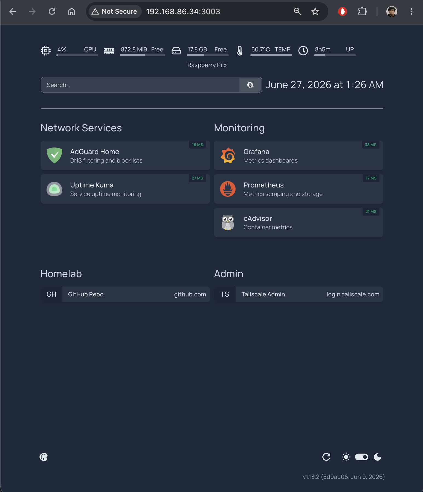
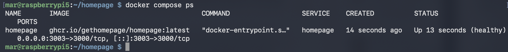

# Homelab Dashboard with Homepage

A single dashboard for my homelab, built with Homepage and running in Docker on the Raspberry Pi 5. It pulls all my self-hosted services onto one page with live up/down status, quick links, and the Pi's system stats. It is the front page of the homelab, and it is what the rack's touchscreen will display in kiosk mode.

## Overview

Homepage is a self-hosted dashboard configured entirely through YAML files. This setup groups my services (AdGuard Home, Uptime Kuma, Grafana, Prometheus, cAdvisor) into sections, shows a live status dot for each by pinging it, and displays the Pi's CPU, memory, temperature, and disk usage across the top. Everything is defined in config files that live in this repo, so the whole dashboard is reproducible.

## Purpose

As the homelab grew to five-plus services on different ports, I wanted one place to see and reach all of them instead of remembering a list of IP-and-port combinations. Homepage gives me that, and because it is config-driven and containerized, it is also a clean way to practice Docker and keep the setup version controlled. It runs on the main Pi now and becomes the display for a touchscreen operations console on a second Pi later.

## Technologies Used

- Raspberry Pi 5 (Raspberry Pi OS Lite, 64-bit)
- Docker
- Homepage (gethomepage.dev), a YAML-configured self-hosted dashboard

## Architecture

```
Touchscreen / browser
        |
        v
Homepage (Docker container, port 3003)
        |
        v
Tiles and status checks for:
AdGuard Home, Uptime Kuma, Grafana, Prometheus, cAdvisor
plus host system stats (CPU, memory, temp, disk)
```

## Configuration

Homepage is configured through plain YAML files, all in this repo:

- `docker-compose.yml` runs the container and mounts the config folder
- `settings.yaml` sets the title, theme, and layout
- `services.yaml` defines each service tile and its live status check
- `widgets.yaml` adds the system resource widget, a search box, and a clock
- `bookmarks.yaml` holds quick links

To change the dashboard I edit a file and the container picks it up. No clicking through a UI.

## Key Concepts

**Configuration as files:** the entire dashboard is described in YAML rather than set up by hand. That makes it reproducible and reviewable, the same idea as the Terraform project, applied to a dashboard.

**Service status without API keys:** each tile uses a simple reachability check (`siteMonitor`) that pings the service URL and shows an up or down dot. This needs no credentials. Deeper per-service widgets (like AdGuard's blocked-query count) would need an API key for each service, which is a planned follow-up.

**Host stats from inside a container:** the resources widget reads the Pi's real CPU, memory, temperature, and disk, so the numbers are the host's, not the container's.

## Challenges

**Another port conflict.** AdGuard, Uptime Kuma, and Grafana already occupy 3000 through 3002, so Homepage runs on 3003.

**Allowed hosts.** Homepage blocks requests from hosts it does not recognize, so I set the Pi's IP and port explicitly in the Compose file so the dashboard loads on the LAN.

## Lessons Learned

A dashboard is only as useful as it is current, and config-as-files keeps it that way. Adding a new service is one entry in `services.yaml`, committed to the repo, rather than a manual step I would forget.

This ties the homelab together visually. The individual projects already existed; Homepage is the single pane that makes them feel like one system, which is exactly what the touchscreen needs to display.

## Future Improvements

- Add API-based widgets for live AdGuard, Uptime Kuma, and Grafana stats
- Point the second Pi's touchscreen at this dashboard in Chromium kiosk mode
- Add Docker container status using the mounted Docker socket

## Running it

```bash
docker compose up -d
```

The dashboard is then at `http://<pi-ip>:3003`.

## Screenshots

The Homepage dashboard showing services and system stats:



The dashboard running as a container alongside the rest of the stack:


