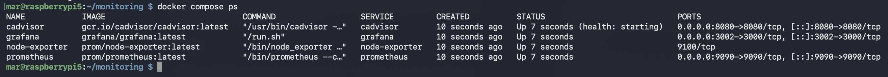
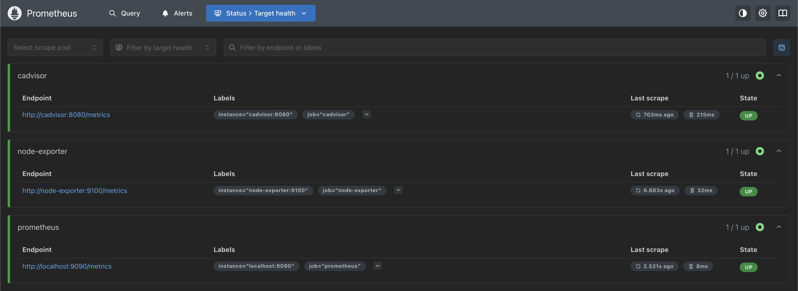
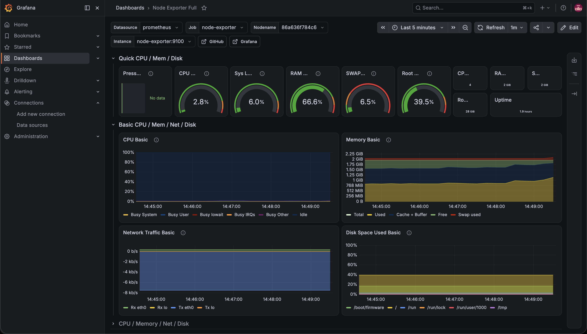

# Metrics Monitoring with Prometheus and Grafana

A metrics monitoring stack running in Docker on a Raspberry Pi 5. Prometheus collects time-series metrics from the Pi and its containers, and Grafana turns them into dashboards. Where my uptime monitoring answers "is it up," this answers "how is it performing," with CPU, memory, disk, network, and container metrics over time.

## Overview

This stack runs four containers defined in a single Docker Compose file. Prometheus scrapes metrics on a schedule and stores them. node-exporter exposes the Pi's host metrics, cAdvisor exposes per-container metrics, and Grafana queries Prometheus and renders the dashboards. The result is a live view of how the Pi and everything on it is doing, not just whether it is reachable.

## Purpose

I already had uptime monitoring, which tells me when something has gone down. I wanted the layer above that: the resource usage and trends that let me see a problem coming, like memory filling up or disk running low, before it causes an outage. Prometheus and Grafana are also the standard observability stack in industry, so this is a chance to learn the real tools, plus Docker Compose for running a multi-container app as one unit.

## Technologies Used

- Raspberry Pi 5 (Raspberry Pi OS Lite, 64-bit)
- Docker and Docker Compose
- Prometheus (time-series database and scraper)
- node-exporter (host metrics: CPU, memory, disk, network)
- cAdvisor (per-container metrics)
- Grafana (dashboards and visualization)

## Architecture

```
node-exporter (host metrics)        cAdvisor (container metrics)
            \                          /
             v                        v
              Prometheus   scrapes and stores time-series, port 9090
                    |
                    v
              Grafana   queries Prometheus and renders dashboards, port 3002
```

## Implementation Steps

- Wrote a `docker-compose.yml` defining Prometheus, node-exporter, cAdvisor, and Grafana on one network
- Wrote a `prometheus.yml` telling Prometheus which targets to scrape
- Brought the whole stack up with `docker compose up -d`
- Confirmed Prometheus listed all targets as UP
- Added Prometheus as a data source in Grafana and imported a Node Exporter dashboard
- Mapped Grafana to port 3002 to avoid the AdGuard admin panel on port 3000

## Key Concepts

**Metrics vs uptime monitoring:** uptime monitoring records up or down. Metrics monitoring records continuous measurements like CPU percentage and memory usage over time, which shows trends and catches slow problems an up/down check would miss.

**Prometheus pull model:** Prometheus scrapes (pulls) metrics from each target on an interval, rather than having applications push data to it. Each target exposes a `/metrics` endpoint that Prometheus reads.

**Exporters:** an exporter translates system or application stats into the format Prometheus understands. node-exporter exposes the host's CPU, memory, disk, and network metrics, and cAdvisor exposes per-container metrics.

**Grafana:** Grafana does not store data. It queries Prometheus using PromQL and visualizes the results as dashboards. The metrics live in Prometheus; Grafana is the front end.

**Docker Compose:** Compose defines a multi-container application in one file, so the whole stack starts together, shares a network, and the containers can reach each other by name (for example, Prometheus scrapes `node-exporter:9100`).

## Challenges

**Port conflict, again.** Grafana defaults to port 3000, which AdGuard Home already uses on this Pi, so I mapped Grafana to 3002 in the Compose file.

**Container-to-container networking.** Prometheus reaches the exporters by their Compose service names, not by `localhost`, because each container has its own network namespace and `localhost` inside the Prometheus container means the Prometheus container itself. Getting the scrape targets right was the part that took understanding.

**Reading host metrics from inside a container.** node-exporter runs in a container but needs the Pi's real CPU, memory, and disk stats, so it mounts the host's `/proc`, `/sys`, and `/` read-only and is pointed at those paths. The metrics are the Pi's, not the container's.

## Lessons Learned

This is the layer above uptime monitoring. Availability tells me something died; metrics tell me it is about to. Running both gives a fuller picture than either alone.

Docker Compose makes a multi-service setup reproducible. The entire monitoring stack is now defined in two small files I can commit and redeploy anywhere, instead of a list of commands I have to remember.

Prometheus pulls rather than being pushed to. That scrape model and the exporter pattern are how a lot of production monitoring actually works, so it was worth understanding rather than just clicking through.

## Future Improvements

- Add Alertmanager so high CPU or low disk sends me a notification
- Build dashboards aimed specifically at the DNS and uptime services
- Increase retention or add remote storage for longer-term historical trends

## Running it

```bash
docker compose up -d
```

Grafana is then at port 3002, Prometheus at 9090. Add Prometheus as a Grafana data source at `http://prometheus:9090` and import a Node Exporter dashboard to see the Pi's metrics.

## Screenshots

The monitoring stack running in Docker:



Prometheus showing all scrape targets up:



Grafana dashboard with live Raspberry Pi metrics:


