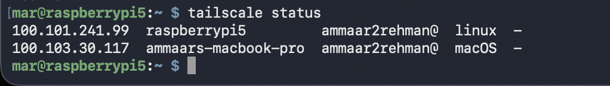
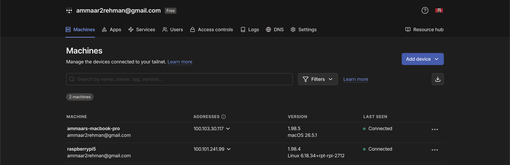
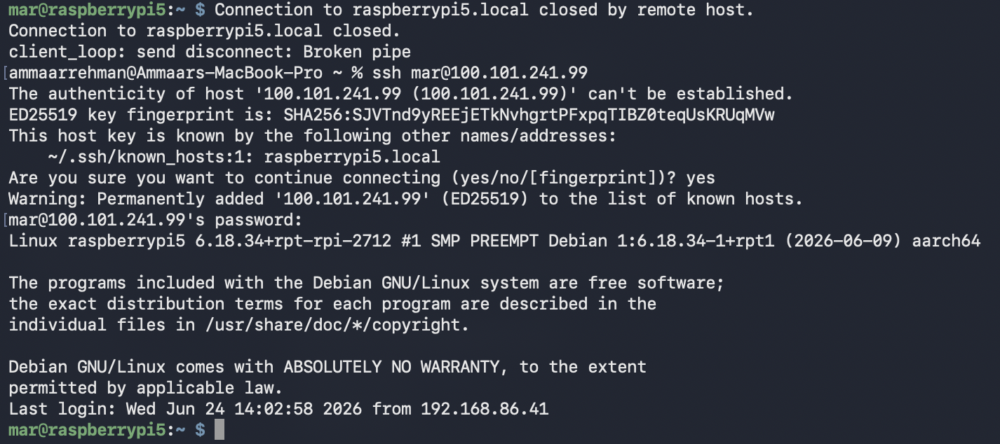

# Remote Access with Tailscale

Secure remote access to my Raspberry Pi and the services on it from any network, without opening a single port on the router. Built on Tailscale, a mesh VPN that uses the WireGuard protocol underneath.

## Overview

Tailscale puts my devices on a private mesh network called a tailnet. Once the Pi, my laptop, and my phone are signed into the same tailnet, I can SSH into the Pi and reach its services (AdGuard Home, Unbound, Uptime Kuma) from anywhere, using a private 100.x address, as if I were sitting at home. Nothing is exposed to the public internet.

## Purpose

I wanted to manage the Pi and reach its services while I'm away from home, like on campus or at an event, without putting anything on the public internet. I also can't change router settings on this network, so a traditional VPN that needs port forwarding is off the table. Tailscale solves both problems at once: it needs no inbound ports, and the Pi stays unreachable to anyone outside my own tailnet.

## Technologies Used

- Raspberry Pi 5 (Raspberry Pi OS Lite, 64-bit)
- Tailscale (mesh VPN built on the WireGuard protocol)

## Architecture

```
Laptop or phone (any network, anywhere)
        |
        |   encrypted WireGuard tunnel across the tailnet
        v
Tailscale coordination and NAT traversal (encrypted DERP relay as fallback)
        |
        v
Raspberry Pi 5 (Tailscale IP 100.x.y.z) -> AdGuard Home, Unbound, Uptime Kuma
```

## Implementation Steps

- Installed Tailscale on the Pi with the official install script
- Authenticated the Pi to my tailnet through the sign-in URL
- Installed Tailscale on my Mac and phone and signed into the same account
- Confirmed the devices could see each other with `tailscale status`
- Disabled key expiry for the Pi in the admin console so the always-on connection does not drop
- SSH'd into the Pi over its Tailscale IP from a different network to prove remote access works

## Key Concepts

**Mesh VPN:** Tailscale builds direct, encrypted connections between my own devices rather than funneling all traffic through one central VPN server. It is a mesh because devices talk to each other peer to peer.

**Built on WireGuard:** the actual encrypted tunnels use the WireGuard protocol. Tailscale adds the parts that are normally manual: key exchange, device authentication, and connection setup.

**Why no port forwarding (the key idea):** normally, reaching a device behind a home router from outside means opening an inbound port on the router so outside traffic can find its way in. That exposes the device to the public internet. Tailscale avoids this with NAT traversal: both devices reach out to a coordination server, exchange connection details, and punch a direct path through their respective NATs. If a direct path cannot be made, traffic falls back to an encrypted relay. Either way, no inbound port is ever opened on the router, so nothing is publicly exposed.

**Zero Trust model:** every device has to be authenticated to the tailnet before it can join. Access is based on device identity, not on whether something is inside a network perimeter.

**MagicDNS:** lets me reach the Pi by name across the tailnet instead of memorizing its 100.x address.

## Challenges

**No router access.** I cannot forward ports on this network, which rules out the traditional approach of exposing a VPN port. Tailscale was the right fit precisely because it needs no inbound ports at all.

**Understanding that this is not a public server.** At first it felt like I had exposed the Pi to the internet. I had not. The Pi is only reachable by devices signed into my own tailnet, which is the opposite of opening a port to the world.

**Key expiry.** Tailscale device keys expire by default, which would silently kill the Pi's remote access after a while. Since the Pi is an always-on server, I disabled key expiry for it in the admin console.

## Lessons Learned

Remote access does not require exposing anything publicly. NAT traversal gets a connection through without an open inbound port, which is both easier and safer than port forwarding. That reframed how I think about reaching home services from outside.

Tailscale trades control for convenience. It manages keys and routing for me, which is great, but it also hides the mechanics. That is exactly why I want to set up WireGuard by hand next, to see the parts Tailscale automates.

This made the rest of the homelab actually usable. I can now reach AdGuard, Unbound, and Uptime Kuma from anywhere, so the DNS and monitoring work is not stuck at home.

## Future Improvements

- Set up WireGuard manually with PiVPN to compare a self-hosted VPN against this managed mesh, and to learn keys, NAT, and port forwarding directly. This needs router access for the inbound port, which I do not currently have.
- Enable Tailscale SSH so SSH is authenticated by tailnet identity instead of a password.
- Define access control rules to limit which devices can reach which services.

## Screenshots

Devices connected on the tailnet, shown by `tailscale status`:



Tailscale admin console listing the machines on my tailnet:



SSH into the Pi over its Tailscale IP from a different network:


