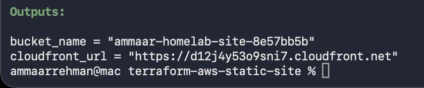
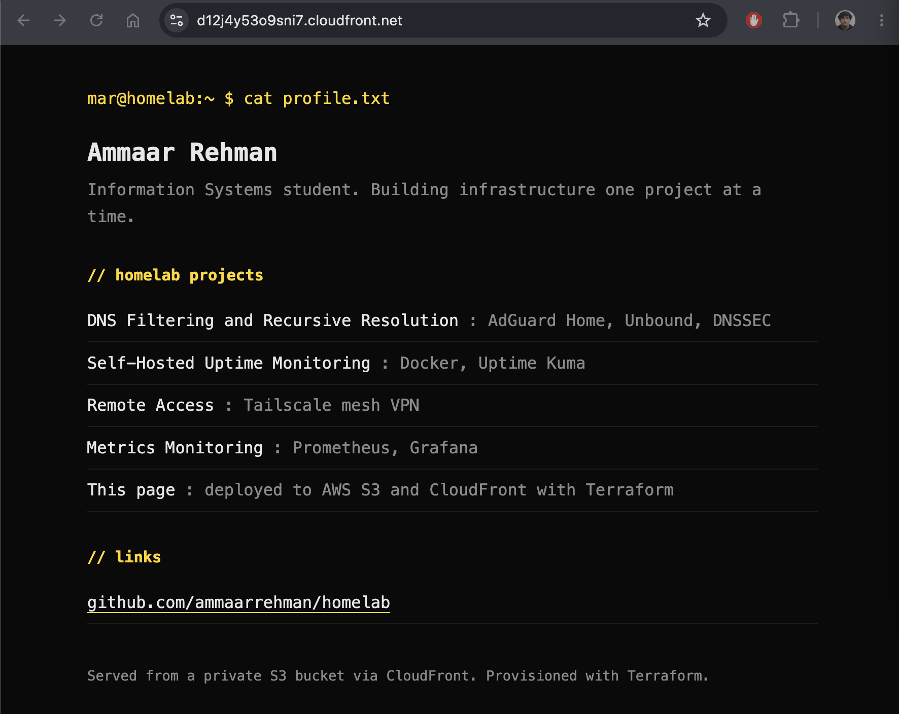
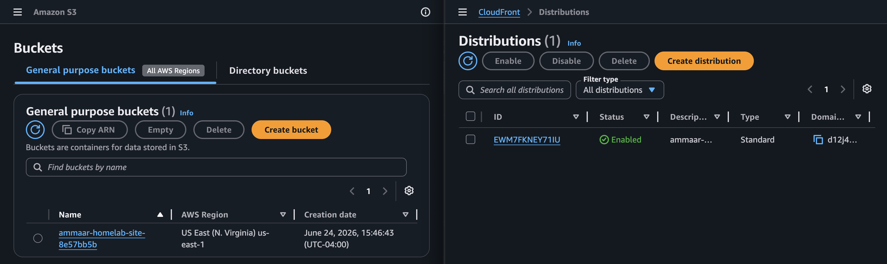

# Static Site on AWS with Terraform

A static website provisioned entirely with Terraform: a private S3 bucket for storage and a CloudFront distribution serving it over HTTPS. The whole thing is defined in code, deploys with one command, and tears down with another. This is my first Infrastructure as Code project and my first time provisioning real cloud resources from a config file instead of clicking through a console.

## Overview

Terraform reads a set of `.tf` files describing the infrastructure I want, then creates it on AWS. Here it creates a private S3 bucket, uploads the site, sets up a CloudFront distribution with Origin Access Control so only CloudFront can read the bucket, and serves the page over HTTPS at a CloudFront URL. Nothing is configured by hand in the console, so the setup is repeatable and version controlled.

## Purpose

My homelab so far is all on-premise on a Raspberry Pi: Linux, networking, monitoring, and a VPN. The gap was cloud and Infrastructure as Code, which is exactly what this fills. I wanted to provision real AWS resources declaratively, understand the Terraform workflow, and do it following good practices: a private bucket rather than a public one, and cost controls so a learning project cannot surprise me with a bill. It also builds on my AWS Cloud Practitioner background by putting it into practice.

## Technologies Used

- Terraform (Infrastructure as Code)
- AWS S3 (private object storage for the site)
- AWS CloudFront (CDN serving the site over HTTPS)
- CloudFront Origin Access Control (keeps the S3 bucket private)

## Architecture

```
Browser
   |
   |  HTTPS
   v
CloudFront distribution  (default *.cloudfront.net domain, HTTPS)
   |
   |  reads via Origin Access Control
   v
Private S3 bucket  (public access blocked, holds index.html)

All of the above is defined in Terraform and created with `terraform apply`.
```

## Implementation Steps

- Installed Terraform and the AWS CLI, and configured AWS credentials for a dedicated IAM user
- Set a billing budget alarm before creating anything
- Wrote `main.tf` defining the S3 bucket, public access block, CloudFront distribution, Origin Access Control, and bucket policy
- Wrote `variables.tf` and `outputs.tf` for inputs and the resulting URL
- Ran `terraform init`, reviewed `terraform plan`, then `terraform apply`
- Opened the CloudFront URL from the output to confirm the live HTTPS site

## Key Concepts

**Infrastructure as Code:** instead of clicking through the AWS console, the infrastructure is described in files. Running Terraform makes reality match the files. The benefit is that the setup is repeatable, reviewable, and version controlled, and I can recreate or destroy it exactly the same way every time.

**Declarative model and the plan/apply workflow:** I describe the end state I want, not the steps to get there. `terraform plan` shows what Terraform will add, change, or destroy before anything happens, and `terraform apply` makes the change. Seeing the plan first is the safety net.

**State:** Terraform records what it has created in a state file so it knows the difference between what exists and what the files describe. The state file can contain resource details, so it is kept out of version control.

**Origin Access Control:** the S3 bucket blocks all public access. CloudFront is granted read access through OAC and a bucket policy scoped to this one distribution, so the site is only reachable through CloudFront, never directly from S3. This is the current AWS best practice for serving a private bucket.

**Why no Route 53:** a custom domain would need a Route 53 hosted zone and a registered domain, both of which cost money. Serving over the default CloudFront HTTPS URL keeps the project inside the free tier while still demonstrating the same S3 and CloudFront work.

## Cost

This runs inside the AWS Free Tier. CloudFront's always-free tier covers 1 TB of transfer and 10 million requests per month, well beyond a personal page, and the S3 storage for a few kilobytes is negligible. I set a budget alarm before deploying as a safety net, and `terraform destroy` removes every resource when I am done. Skipping Route 53 keeps it free, since a hosted zone is the one piece here that would carry a monthly charge.

## Challenges

**Globally unique bucket names.** S3 bucket names have to be unique across all of AWS, so a fixed name fails if anyone has used it. I append a random suffix in Terraform so the name is always unique.

**Keeping the bucket private.** The straightforward way to serve a static site is a public bucket, but public buckets are discouraged. Wiring up Origin Access Control and a scoped bucket policy so only CloudFront can read the bucket took the most thought, and it is the more secure and more current approach.

**CloudFront takes time to deploy.** A distribution takes several minutes to roll out, so `terraform apply` does not finish instantly. That is normal, not a hang.

## Lessons Learned

Infrastructure as Code changes how I think about building things. Once it is in code, standing the whole stack up or tearing it down is one command, and I can read the diff before anything changes. That is a different level of control than clicking through a console and hoping I remember what I did.

Good defaults matter on cloud. Blocking public access and serving through CloudFront with OAC is barely more work than a public bucket and is far safer. Setting a budget alarm before deploying is the habit that keeps a learning project from becoming a bill.

This connects the rest of the homelab to the cloud. The on-premise Pi work plus a real Terraform-provisioned AWS deployment covers both sides, which is the combination I want going into IT and cloud roles.

## Future Improvements

- Add a custom domain with Route 53 and an ACM certificate (accepting the small hosted-zone cost)
- Move Terraform state to a remote S3 backend so it is not only on my laptop
- Add a GitHub Actions workflow to run plan and apply automatically on changes

## Running it

```bash
terraform init
terraform plan
terraform apply
```

The site URL is printed as the `cloudfront_url` output. To remove everything:

```bash
terraform destroy
```

## Screenshots

Terraform apply completing, with the CloudFront URL in the output:



The live site served over HTTPS from CloudFront:



The S3 bucket and CloudFront distribution in the AWS console:


