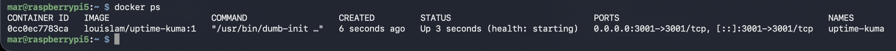
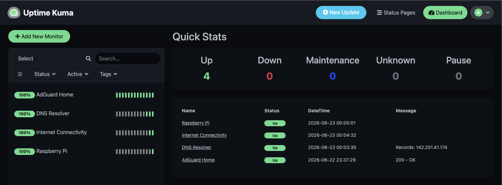
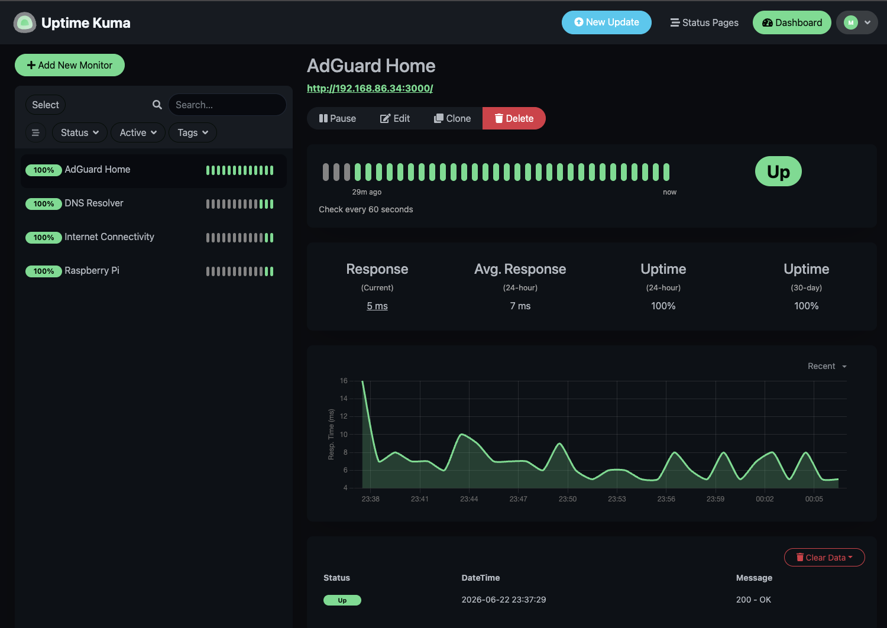

# Self-Hosted Uptime Monitoring with Uptime Kuma

A self-hosted monitoring dashboard running in Docker on a Raspberry Pi 5. It watches my self-hosted services and connectivity, records uptime, and shows status at a glance so I find out about problems before a device does.

## Overview

Uptime Kuma runs as a Docker container on the Pi and polls a set of endpoints on a schedule. It tracks whether each one is up, how fast it responds, and its uptime percentage over time, all on a single dashboard. The first things it monitors are the services from my DNS project: AdGuard Home and DNS resolution through the Pi.

## Purpose

After building the DNS stack, I had services that other devices depend on, and I had already seen what happens when one goes down. When I shut the Pi off earlier, my phone lost internet because its DNS still pointed at the Pi. Monitoring is the direct answer to that: a dashboard that tells me a service is down instead of me finding out when something stops working. This is also my first hands-on Docker deployment, so it doubles as a way to learn containers.

## Technologies Used

- Raspberry Pi 5 (Raspberry Pi OS Lite, 64-bit)
- Docker (container runtime)
- Uptime Kuma (self-hosted monitoring, running in a container)

## Architecture

```
Uptime Kuma        Docker container, port 3001
        |
        v
Monitors           HTTP, DNS, and ping checks run on a schedule
        |
        v
Watched targets    AdGuard Home (:3000), DNS resolution via the Pi, the Pi host itself, internet connectivity
```

## Implementation Steps

- Installed Docker with the official install script
- Added my user to the docker group so containers run without sudo
- Ran Uptime Kuma as a container with a named volume for persistence and a restart policy so it survives reboots
- Created the admin account and added monitors for AdGuard Home, DNS resolution through the Pi, the Pi host itself, and general connectivity

## Key Concepts

**Docker and containers:** a container packages an application with everything it needs to run, isolated from the host system. It is lighter than a full virtual machine because it shares the host's kernel instead of booting its own. That makes deploying a service like Uptime Kuma a single command rather than a manual install.

**Why a named volume:** containers are disposable, and anything written inside one is lost if the container is removed or recreated. Mounting a named volume (`uptime-kuma:/app/data`) keeps the data outside the container, so my monitors and their history survive restarts and updates.

**Why a restart policy:** `--restart=unless-stopped` tells Docker to bring the container back automatically after a reboot or crash. Without it, monitoring would stop the next time the Pi restarted and I would have to start it by hand, which defeats the point of a monitor.

**What Uptime Kuma does:** it checks each target on an interval using monitor types like HTTP, DNS, and ping. It records whether the target responded, how long it took, and the uptime percentage over time, then shows all of it on one dashboard.

## Challenges

**The docker group needs a fresh login.** After adding my user to the docker group, Docker still asked for sudo. Group membership only takes effect on a new login, so I rebooted and then Docker worked without sudo.

**Avoiding a port conflict.** AdGuard Home already runs its admin panel on port 3000, so I mapped Uptime Kuma to 3001 to keep them from colliding on the same Pi.

**Making it survive a reboot.** A plain `docker run` would lose its data and stay down after a restart. I mounted a named volume so the monitor history persists and set a restart policy so the container comes back on its own, which matters because a monitor that does not auto-start is useless.

## Lessons Learned

This project exists because of a real failure. When the Pi went down, my phone lost internet and I had no way of knowing the service was the cause until I worked it out. Monitoring is how I would have caught that immediately, which made the value concrete instead of theoretical.

Docker turns deploying a service into one command and keeps it isolated from the host. That isolation is the appeal, but it also means nothing inside the container persists unless I deliberately mount a volume.

Building monitoring right after the DNS project showed me how homelab pieces stack. The thing I built first became the first thing worth watching.

## Future Improvements

- Add notifications (email, Discord, or Telegram) so I am alerted the moment a service goes down
- Grow into a Grafana and Prometheus stack for longer-term metrics and richer dashboards
- Add a monitor for every new service as the homelab grows

## Screenshots

Uptime Kuma container running in Docker:



Monitoring dashboard with services reporting up:



Monitor detail showing uptime history and response time:


